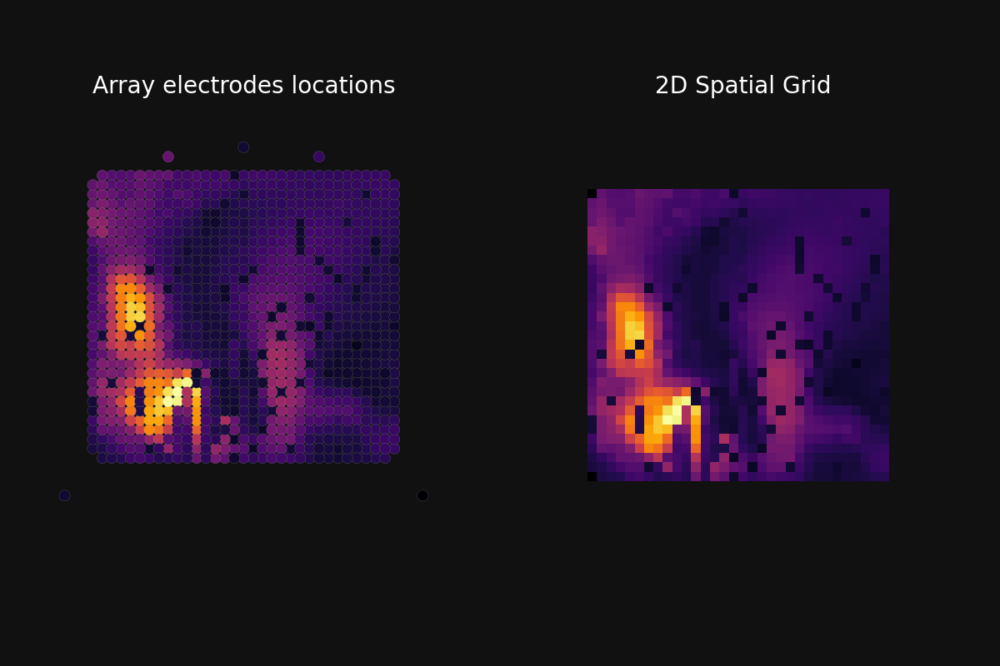

# Dataset

## Data Collection

This dataset contains neural recordings from primary auditory cortex in response to tone stimuli.

### Experimental Setup

**Animal Model:**
- Swine (pig) model sedated under isoflurane anesthesia
- One Precision Layer 7 array (1024 channels) placed over primary auditory cortex under dura

**Stimulus Presentation:**
- Auditory tones presented from a loudspeaker placed 1 meter away
- Multiple tone frequencies presented in a predetermined sequence
- Audio from inside the experiment room captured as an analog input signal

**Data Acquisition:**
- Neural signals recorded from 1024 channels downsampled to 1000 Hz sampling rate
- Stimulus onset and offset times determined by thresholding the smoothed audio signal
- Tone frequency (label) assigned based on the predetermined stimulation order

### Reference Electrode

One electrode on the array was designated as the reference electrode. This electrode is included in the 1024 channels but is not part of the main 33×31 grid of recording electrodes.

### Preprocessing

**The data is provided in raw form with no filtering or preprocessing applied.** This allows you to apply your own preprocessing pipeline as needed.

**Hardware Specifications:** If your work requires detailed amplifier specifications, see [Intan RHD2000 Series](https://intantech.com/products_RHD2000.html). Most participants will not need this information.


## Data Format

### Features

Features are stored as pandas DataFrames with time in seconds as the index and 1024 columns representing voltage measurements from a micro-ECoG electrode array.

**Specifications:**
- **Shape**: `(n_samples, 1024)` where n_samples varies by dataset split
- **Index**: Time in seconds (float)
- **Columns**: 1024 channels, each representing voltage from one electrode
- **Sampling Rate**: 1000 Hz (1 millisecond per sample)
- **Preprocessing**: None—this is raw voltage data

### Labels

Labels are also pandas DataFrames with time in seconds as the index, matching the features exactly.

**Specifications:**
- **Shape**: `(n_samples, 1)` - same number of samples as features
- **Index**: Time in seconds (float), aligned with features
- **Column**: `'label'` containing numeric values:
  - `0`: No stimulus (silence)
  - `> 0`: Tone frequency in Hz (e.g., 250, 500, 1000, etc.)

**Note:** The stimulus presentation parameters (inter-stimulus interval, stimulus duration, etc.) remain unchanged between training/validation and test data.

## Getting the Data

The BrainStorm 2026 Track 1 dataset is hosted on Hugging Face and can be downloaded using the provided download utilities.

### Downloading Training and Validation Data

Use the `download_train_validation_data()` function to download the publicly available training and validation splits:

```python
from brainstorm.download import download_train_validation_data

# Download all training and validation data
train_features, train_labels, val_features, val_labels = download_train_validation_data()

# Data is saved to ./data/ and returned as pandas DataFrames
print(f"Training features shape: {train_features.shape}")
print(f"Training labels shape: {train_labels.shape}")
print(f"Validation features shape: {val_features.shape}")
print(f"Validation labels shape: {val_labels.shape}")
```

This downloads the following files from the public Hugging Face repository:
- `train_features.parquet` - Training features (1024 channels)
- `train_labels.parquet` - Training labels
- `validation_features.parquet` - Validation features (1024 channels)
- `validation_labels.parquet` - Validation labels

Files are cached locally in `./data/`, so subsequent calls are fast.

### Test Data is Private

**Important**: The test data split is held in a private repository and is **not accessible** to participants. The `download_test_data()` function exists in the codebase but requires an authentication token that only the organizers have access to.

Use the validation split for local testing and hyperparameter tuning.

## Loading Data

Once downloaded, the DataFrames are returned directly and ready to use. To reload data in a new session:

```python
from pathlib import Path
from brainstorm.loading import load_raw_data

DATA_PATH = Path("./data")

# Load training data
train_features, train_labels = load_raw_data(DATA_PATH, step="train")

# Load validation data
validation_features, validation_labels = load_raw_data(DATA_PATH, step="validation")
```

## Spatial Layout of Electrodes

The 1024 electrodes are arranged in an approximate 31×32 grid on the cortical surface. However, **this is not a perfect 2D grid** like an image, as you can see below.

### Channel Coordinates

Each channel has a corresponding 2D coordinate representing its physical position in the electrode array:

```python
from brainstorm.loading import load_channel_coordinates

# Get electrode coordinates
channel_coords = load_channel_coordinates()  # Shape: (1024, 2)

# Each row contains (x, y) coordinates for that channel
# channel_coords[i] = [x_position, y_position] for channel i
```

### Visualizing the Electrode Array

The electrode layout can be visualized using the provided plotting utilities. See `examples/signal_plot.py` for a complete example that visualizes signal variance across the electrode array:

```python
from pathlib import Path
from brainstorm.loading import load_raw_data, load_channel_coordinates
from brainstorm.plotting import dot_plot
import matplotlib.pyplot as plt

DATA_PATH = Path("./data")

# Load data
train_features, train_labels = load_raw_data(DATA_PATH, step="train")
channel_coords = load_channel_coordinates()

# Compute per-channel variance as an example metric
channel_variances = train_features.var(axis=0)

# Plot the variance at each electrode position
fig, ax = dot_plot(
    channel_variances.values, 
    channel_coords, 
    marker_size=200
)
plt.show()
```

This produces a visualization showing the 2D layout of electrodes colored by signal variance:



*Generated by `examples/signal_plot.py` - Each dot represents one electrode, positioned according to its physical location on the array. Color indicates signal variance.*

### Converting Channel Data to Spatial Representation

For models that benefit from spatial structure (e.g., CNNs), you can convert channel data to a 2D spatial representation:

```python
from brainstorm.spatial import channels_to_spatial

# Example: Convert a single sample from channel to spatial representation
sample = train_features.iloc[0].values  # Shape: (1024,)
spatial_sample = channels_to_spatial(sample, channel_coords)  # Shape: (31, 32)

# Now you can use this as input to a 2D CNN
```

**Notes:**
- Function operates on single samples (1D arrays of 1024 channels)
- Output is a 31×32 grid (31 rows, 32 columns)
- Not all grid positions contain electrodes (some are zero)
- The spatial representation preserves geometric relationships between nearby electrodes
- For batch processing, loop over samples or use your own batching logic

## Data Splits

Your data directory contains two accessible splits:

1. **Training** (`train_features.parquet`, `train_labels.parquet`): Use this to train your model
2. **Validation** (`validation_features.parquet`, `validation_labels.parquet`): Use this for local evaluation and hyperparameter tuning

The **test** split is held out for remote evaluation only—you cannot access it locally.
